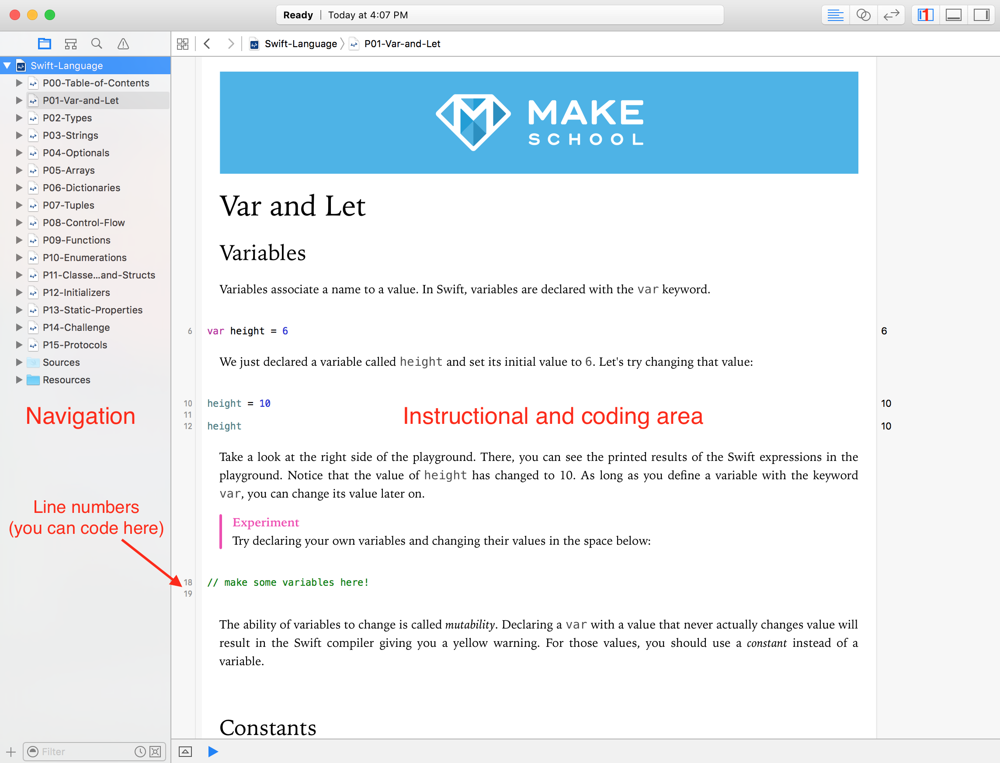
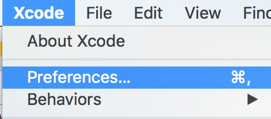
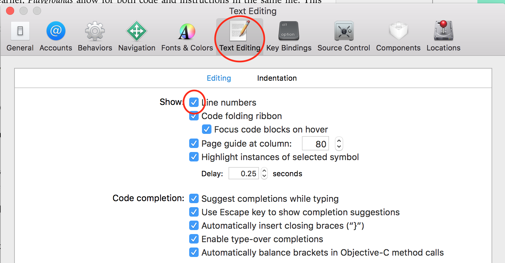
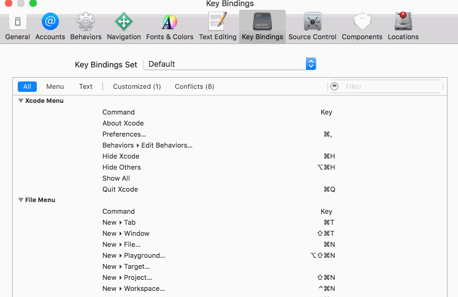
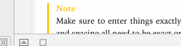
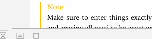
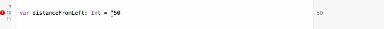
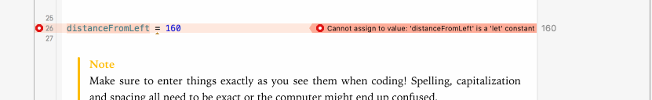
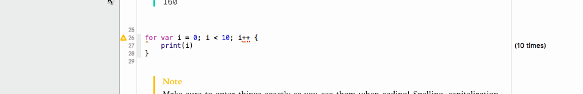

Download the _Swift Playground_ [here](https://github.com/MakeSchool-Tutorials/Swift-Language-Playgrounds/archive/master.zip). _Playgrounds_ are interactive coding environments that can contain instructions. You can think of it as a textbook you can code in!

Go through the playground and you'll get a great introduction to a bunch of programming concepts in _Swift_, including:

1. `var` vs. `let`
1. Types
1. Strings
1. Optionals
1. Arrays
1. Dictionaries
1. Tuples
1. Control flow
1. Functions
1. Classes and structs
1. Initializers
1. Type (static) properties
1. Protocols

Once you have the Playground opened, go through the material below before you get started.

# About Playgrounds

Before you get started, there are a few things you should know about _Swift Playgrounds_.

## What are Playgrounds?

_Playgrounds_ are interactive coding environments that can contain instructions. The code you write gets run every time you make a change and visual output is displayed on the right. This makes it a great way to learn how to code!

# Playground interface

There are two main areas you need to worry about in the intro track playgrounds: navigation and the instructional & coding area.

## Navigation

You can use this are to navigate directly to another page. The instructional and coding area also has next and previous page buttons at the bottom. If you do not see the navigation area, it can be opened with the button marked `1` in the above screenshot.

## Instructional & coding area

This is where you'll be doing most of your work. This area allows for nicely formatted instructions and areas to code! Any areas that have line numbers next to them can be used for coding.

# Setting up Xcode

There are two things we need to do to make our Xcode and Playground experience better. You should do this as soon as you start your first playground, it only needs to be done once!

> [action]
> ## Turning on line numbers
1. Go to `Xcode > Preferences` in the menu bar. 
1. Click `Text Editing` in the popup. Check the box next to _Line Numbers_. 
>
> ## Creating a keyboard shortcut
1. Click `Key Bindings` (it's next to `Text Editing`).
1. Enter `execute` in the search bar.
1. Double-click the white space next to `Execute Playgrounds`.
1. Press and hold the `option` key then press `r`.
1. Click in the whitespace below.
1. Verify the shortcut was added by watching this gif. The shortcut you added should match the gif.
>

# Running code in Playgrounds

By default, Playgrounds will run the code every-time you stop typing. The visualization will restart and be updated with your new code!

## Re-running your code manually

If this does not seem to be working, you can re-run it by toggling the play/stop button at the bottom-left of your instructional & coding area. 

## Slower computers

The auto-run feature might not work well on slower computers. You can turn it off by clicking and holding on the play/stop button then selecting `Manually Run`. 

Now you can run your code when you are ready! By following the steps above or holding the `option` key and pressing `r` (this will only work if you setup the keyboard shortcut above).

# My code is not working!

Playgrounds use a few different symbols to notify you when you have inputed code that will not work. Don't worry too much about the code in these examples, focus on the symbols presented.

It's good to understand what Xcode is trying to tell. Sometimes the message presented will be enough to help you fix it on your own. Other times it will be cryptic and you'll need to ask another student or instructor for help -- it is okay to ask for help!

## Error

Errors are a red octagon with a `!` inside. Click them to read the message. You _must_ fix the error for your code to finish running!

## Error with suggestion

Errors with suggestions have a white circle inside instead of an `!`. When you double-click them, they pop up a `Fix-it` suggestion. You can double-click the suggestion and Xcode will try to automatically fix the problem. You _must_ fix the error for your code to finish running!

## Warning

Warnings do not stop your code from running. They are represented by a yellow triangle. Just like errors, they might have `Fix-it` suggestions.

Another thing to note in this example is some warnings and errors will have multiple messages associated with them. See how we click the grey `2` in the example to view both messages.
